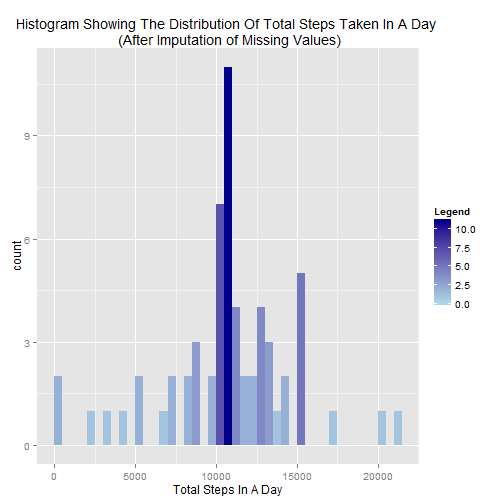

Reproducible Research Project 1
===============================


```r
library(data.table)
library(ggplot2)
library(reshape2)
```

###Downloading and Reading in the Data

The Data can be downloaded using the link:
[Download Step Data](https://d396qusza40orc.cloudfront.net/repdata%2Fdata%2Factivity.zip) [52K]

Save the .zip file as ***ActivityMonitoring.zip*** in your working directory.

The variables included in this dataset are:

+ steps: Number of steps taking in a 5-minute interval (missing values are coded as NA)  
+ date: The date on which the measurement was taken in YYYY-MM-DD format  
+ interval: Identifier for the 5-minute interval in which measurement was taken 
+ interval value: A value of 1435, for example, corresponds to 14:35pm

The dataset is stored in a comma-separated-value (CSV) file and there are a total of 17,568 observations in this dataset.


```r
unzip("ActivityMonitoring.zip", overwrite = T, unzip="internal")
```

```
## Warning in unzip("ActivityMonitoring.zip", overwrite = T, unzip =
## "internal"): error 1 in extracting from zip file
```

```r
ActivityData <- data.table(read.csv("activity.csv", colClasses=c("integer","Date","integer")))
```

```
## Warning in file(file, "rt"): cannot open file 'activity.csv': No such file
## or directory
```

```
## Error in file(file, "rt"): cannot open the connection
```

```r
setkey(ActivityData, date, interval)
```

**Important Step:**  
The most challenging part of this assignment (for me at least) was converting the interval into a proper time format.  
If left in original form as numeric, then when plotted the gap between 1255 and 1300, for example, would be 45 rather than 5.  
It might therefore lead to misleading and inaccurate graphs.

To overcome this the following code has been used:


```r
times <- ActivityData$interval
hours <- floor(times/100) ##e.g 2345/100=23.45 and so rounding down gives 23 as the hour.
minutes <- times%%100 ##This finds the remainder upon division. e.g 2345/100=23 rem 45, giving 45 as the minutes.

##Putting into a suitable date/time format
times <- format(strptime(paste0(hours,":",minutes), "%H:%M"), "%H:%M")
times2 <- as.POSIXct(paste(ActivityData$date, times))

##Final data with time formatting included
ActivityData <- cbind(ActivityData, time=times, datetime=times2)

##Final Data with time formatting included and NA values removed
ValidActivityData <- ActivityData[!is.na(ActivityData$steps)]
```

###PART 1: What is the mean total number of steps taken per day?

#####Preliminary Calulations
Using the ***tapply()*** function in the base package allows the computation of the total number of *steps* taken per *date*,  
ignoring any missing values. This leads to the follwing data table being produced:

```r
StepsPerDay <- with(ValidActivityData,tapply(steps, date, sum, na.rm=T))
StepsPerDay <- data.table(melt(StepsPerDay, varnames="Date", value.name="TotalSteps"))
MeanDaySteps <- round(mean(StepsPerDay$TotalSteps),4)
MedianDaySteps <- median(StepsPerDay$TotalSteps)
options(scipen=1, digits=4)
head(StepsPerDay,5)
```

```
##          Date TotalSteps
## 1: 2012-10-02        126
## 2: 2012-10-03      11352
## 3: 2012-10-04      12116
## 4: 2012-10-05      13294
## 5: 2012-10-06      15420
```

#####Plotting the Histogram
The table can then be used to plot a histogram showing the distribution of daily total steps:

```r
DayHist <- ggplot(StepsPerDay, aes(x=TotalSteps, fill=..count..)) +
     geom_histogram(origin = 0, binwidth = 500) + 
     scale_fill_gradient("Legend", low="lightsalmon1", high="lightsalmon4") +
     xlab("Total Steps In A Day") +
     ggtitle("Histogram Showing The Distribution Of Total Steps Taken In A Day")
print(DayHist)
```

 

Here, it is shown that the most common number of steps taken in a day is between 10,000 and 10,500,  
with the majority of days seeing somewhere between 7,000 and 15,500 steps taken.

Simple calculations show that the mean number of steps taken per day is **10766.1887**,  
with the median number of steps being **10765**.

###PART 2: What is the average daily activity pattern?

#####Preliminary Calculations
Again, using the ***tapply()*** function allows the mean number of steps taken per 5 minute interval to be found.  
It produces a data table like the following:

```r
StepsPer5Min <- with(ValidActivityData, tapply(steps, time, mean, na.rm=T))
StepsPer5Min <- data.table(melt(StepsPer5Min, varnames="time",value.name="AverageSteps"))
StepsPer5Min
```

```
##       time AverageSteps
##   1: 00:00      1.71698
##   2: 00:05      0.33962
##   3: 00:10      0.13208
##   4: 00:15      0.15094
##   5: 00:20      0.07547
##  ---                   
## 284: 23:35      4.69811
## 285: 23:40      3.30189
## 286: 23:45      0.64151
## 287: 23:50      0.22642
## 288: 23:55      1.07547
```

#####Plotting the Line Graph
This table is then used to produce a line graph to show how the average number of steps changes  
as a day progresses.  


```r
##Code used in plotting
StepsPer5Min$RowNum <- as.numeric(rownames(StepsPer5Min))
MaxAverage <- StepsPer5Min[StepsPer5Min$AverageSteps == max(StepsPer5Min$AverageSteps),]
MaxAverage$time <- as.character(MaxAverage$time)
HourBreaks <- StepsPer5Min$time[seq(1,nrow(StepsPer5Min),by=24)]

##Line Graph
IntervalTS <- ggplot(StepsPer5Min, aes(x=RowNum, y=AverageSteps)) +
     geom_line() + scale_x_continuous(breaks=seq(1,nrow(StepsPer5Min),by=24), labels=HourBreaks) +
     geom_hline(yintercept=max(StepsPer5Min$AverageSteps), colour="blue", linetype="dashed") +
     geom_vline(xintercept=MaxAverage[[3]], colour="blue", linetype="dashed") +
     geom_text(aes(0,MaxAverage[[2]], label = round(MaxAverage[[2]],2), vjust=-0.5), colour="blue", size=4) +
     geom_text(aes(MaxAverage[[3]],0, label = MaxAverage[[1]], hjust=-0.5), colour="blue", size=4) +
     xlab("Interval") + ylab("Average Steps Per Interval") + xlab("Interval") +
     ggtitle("Average Number Of Steps Observed Per 5 Minute Interval") + 
     theme(plot.title = element_text(lineheight=2, face="bold"))
print(IntervalTS)
```

 

Marked on the graph is the interval corresponding to the maximum average number of steps in an interval.  
Therefore, the interval which has the largest average number of steps occured at **08:35**,  
which had an average of **206.1698** steps.

###PART 3: Imputing Missing Values

#####Locating Missing Values
Filtering the ActivityData to only include rows where NA appears, and producing a table to show which date  
they appeared on, will result in the following:


```r
MissingValues <- ActivityData[is.na(ActivityData$steps),]
MissingTable <- table(MissingValues$date)
MissingTable
```

```
## 
## 2012-10-01 2012-10-08 2012-11-01 2012-11-04 2012-11-09 2012-11-10 
##        288        288        288        288        288        288 
## 2012-11-14 2012-11-30 
##        288        288
```
So it is clear that all missing values were observed on 8 of the days.  
Each day had 288 missing values, which indicates that the entire day was unaccounted for.
This leads to a total of **2304** missing values.

#####Imputing Strategy
The method chosen here is probably the easiest to implement. It simply uses the **interval average** (found in part 2) to replace any NA values.  
The drawback of this is that it means each day where every interval was NA will end up having the same total number of steps,  
which in turn could skew the distributions.  
But for the sake of this project it is sufficient, and was also explicitly stated as an option in the instructions.

After replacing the NA values seen in the original data with the corresponding interval averages (rounded as steps are an integer) the  
following table can be found:


```r
Joined <- merge(ActivityData, StepsPer5Min, by="time", all.x=TRUE)
```

```
## Error in merge.data.table(ActivityData, StepsPer5Min, by = "time", all.x = TRUE): x has some duplicated column name(s): time,datetime. Please remove or rename the duplicate(s) and try again.
```

```r
Joined$ImputedSteps <- Joined$steps
Joined$ImputedSteps[is.na(Joined$ImputedSteps)] <- round(Joined$AverageSteps[is.na(Joined$ImputedSteps)],0)

Imp.ActivityData <- Joined[,c(3,1,8), with=FALSE]
setkey(Imp.ActivityData, date, time)
Imp.ActivityData
```

```
##              date  time ImputedSteps
##     1: 2012-10-01 00:00            2
##     2: 2012-10-01 00:05            0
##     3: 2012-10-01 00:10            0
##     4: 2012-10-01 00:15            0
##     5: 2012-10-01 00:20            0
##    ---                              
## 17564: 2012-11-30 23:35            5
## 17565: 2012-11-30 23:40            3
## 17566: 2012-11-30 23:45            1
## 17567: 2012-11-30 23:50            0
## 17568: 2012-11-30 23:55            1
```

The average number of steps per day can then be found in a similar way to part 1, ready for use in the histogram.

#####Histogram for Imputed Steps
The histogram is produced in the following way:

```r
##Initial Calculations
Imp.StepsPerDay <- with(Imp.ActivityData,tapply(ImputedSteps, date, sum, na.rm=T))
Imp.StepsPerDay <- data.table(melt(Imp.StepsPerDay, varnames="Date", value.name="TotalSteps"))

Imp.MeanDaySteps <- mean(Imp.StepsPerDay$TotalSteps)
Imp.MedianDaySteps <- median(Imp.StepsPerDay$TotalSteps) 

##Histogram
Imp.DayHist <- ggplot(Imp.StepsPerDay, aes(x=TotalSteps, fill=..count..)) +
     geom_histogram(origin = 0, binwidth = 500) + 
     scale_fill_gradient("Legend", low="lightblue", high="darkblue") +
     xlab("Total Steps In A Day") +
     ggtitle("Histogram Showing The Distribution Of Total Steps Taken In A Day \n (After Imputation of Missing Values)")
print(Imp.DayHist)
```

 

This is similar to the histogram where NA values were ignored, but there is a notable rise in the number of observations seen to have  
between 10,500 and 11,000 total steps in a day.  
Imputation has caused the mean to fall slightly from **10766.1887** to **10765.6393**, and   the median to fall from **10765** to **10762**.

To more accurately compare the results for non-imputation vs imputation, a density plot can be produced:

```r
Original <- data.table(TotalSteps = StepsPerDay$TotalStep)
Original$Imputed <- 'NO'
New <- data.table(TotalSteps = Imp.StepsPerDay$TotalSteps)
New$Imputed <- 'YES'
Comparison <- rbind(Original, New)

DensPlot <- ggplot(Comparison, aes(TotalSteps, fill = Imputed)) +
               geom_density(alpha = 0.2) +
               ggtitle("Comparing Density of Total Daily Steps Before and After Imputation")
print(DensPlot)
```

 

It is apparent that the only significant change as a result of imputing is the much larger spike in the middle.  
The rest of the distribution may seem to have become less "smooth", but that is a direct result of the taller spike taking a  
higher proportion of the observations. The histograms have shown the actual data to be identical other than this point.

#####Other Resources
There is a number of ways that can be used to impute the missing data. A useful extract can be found [here](http://www.stat.columbia.edu/~gelman/arm/missing.pdf) which describes some of the potential imputation methods.  

There are also a few R packages on CRAN that contain methods for imputing. A couple of these are in the **VIM** package,  
which has functions such as *kNN()* and *irmi()* among others.  
Other packages could be the **mi** package, **Amelia** package, **mice** package and the **norm** package.  
*(I looked into these briefly, but they required some reformatting of my tables and more research into which is best to use for this data)*

###PART 4: Are there differences in activity patterns between weekdays and weekends?

#####Differentiating Between Weekdays and Weekends
The first stage here is to produce an extra column in the *Imp.ActivityData* data table that distinguishes between weekdays and weekends.  
This is done by first assiging values for weekdays and weekends, and using the ***weekdays()*** function on the date column:


```r
Imp.ActivityData$WeekDay <- weekdays(Imp.ActivityData$date)
WeekDay <- c("Monday","Tuesday","Wednesday","Thursday","Friday", "Saturday", "Sunday")
DayClass <- c(rep("WeekDay",5), rep("WeekEnd",2))
WeekdayClass <- cbind(WeekDay,DayClass)
Imp.ActivityData <- merge(Imp.ActivityData, WeekdayClass, by="WeekDay", all.x=TRUE)
setkey(Imp.ActivityData,date, time)
```

Having done that it is then a simple case of aggregating by *time* and *WeekdayClass* to determing the average number of steps per interval.  
This leads to the following data table:

```r
DayClassMeans <- aggregate(ImputedSteps~time+DayClass, data=Imp.ActivityData, mean)
head(DayClassMeans)
```

```
##    time DayClass ImputedSteps
## 1 00:00  WeekDay      2.28889
## 2 00:05  WeekDay      0.40000
## 3 00:10  WeekDay      0.15556
## 4 00:15  WeekDay      0.17778
## 5 00:20  WeekDay      0.08889
## 6 00:25  WeekDay      1.57778
```

#####Plotting multiple line graphs
Finally, a couple more computations allow the line graph to be produced that can compare weekdays to weekends:

```r
DayClassMeans$RowNum <- rep(seq(1:288),2)
HourBreaks2 <- DayClassMeans$time[seq(1,nrow(DayClassMeans),by=24)]

MeanDayClass <- ggplot(DayClassMeans, aes(x=RowNum, y=ImputedSteps, color=DayClass)) +
                    geom_line() + scale_x_continuous(breaks=seq(1,nrow(DayClassMeans),by=24), labels=HourBreaks2) +
                    facet_wrap(~DayClass, nrow=2) + theme_bw() +
                    theme(strip.background = element_rect(fill="peachpuff")) +
                    theme(legend.position = "none") + ylab("Number of Steps") + xlab("Interval") +
                    ggtitle("Comparing Mean Steps Over 5 Minute Intervals Between Weekdays And Weekends")
print(MeanDayClass)
```

 

It can therefore be seen that activity (based on steps) begins earlier during the week, typically starting at around 06:00am. Activity on the weekends,  
however, has a more gradual build up and does not really get going until around 08:00am.  
In addition, activity tends to be higher through the day at weekends. This is in contrast to weekdays where there is typically a spike  
of activity at around 08:30am before dropping off for the rest of the day (*Likely rushing around before work*).

